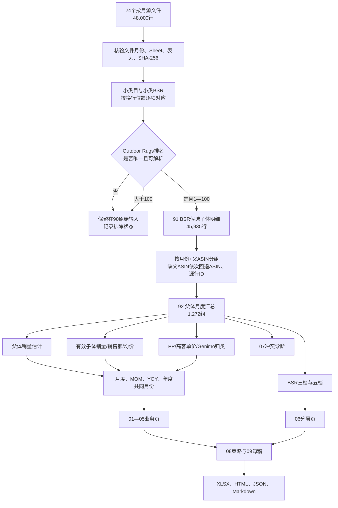

# 户外地垫市场分析：数据处理流程与人工验算

版本：2026-09-22，适用SPEC 3.1。本文是明日人工审查的操作说明。当前结果只能使用本批次新源和本文件所述规则；旧总表、旧参考表和旧SPEC结果均不参与当前计算。

## 1. 本次交付解决什么问题

交付分成四部分：

1. 整体市场：Outdoor Rugs BSR前100候选父体的销量、有效子体销售额、均价、MOM、YOY和BSR分层；
2. PP市场：整体市场中标题按规则命中 `plastic` 的父体；
3. 高客单价市场：整体市场中未归入PP的父体。它是业务名称，不代表每个商品价格一定高；
4. Genimo品牌：同一整体父体池中Genimo父体的表现，并分别展示整体份额和PP内份额，支持2027建议。

报告没有利润、成本、广告、库存或真实成交推断。供应方字段是估算值，清洗只能形成可复核的统一统计口径。

## 2. 输入文件及不可混用范围

唯一输入目录：`data/raw/0920new`。

- 文件数：24；
- 月份：2024.08—2026.07，连续24个月；
- 每个文件只有一个符合 `Competitor-US-YYYYMM` 的业务Sheet；
- 每个业务Sheet月份必须与文件名月份一致；
- 每个文件2,000条业务行，合计48,000行；
- 构建时记录文件名、Sheet名、行数和SHA-256到 `93_来源登记`；
- 原始文件只读，不在原文件内删除、改值或补值。

程序在以下情况直接停止：文件数不是24、月份不连续或重复、业务Sheet月份不符、表头缺失/顺序变化、同一个月份出现重复ASIN。

## 3. 完整数据流程



“父ASIN汇总”不是把候选子体行删除后只保留一条代表行。91页仍保留全部45,935条候选明细；92页对每个指标按自己的字段语义聚合。这样可以回查每个父体的源行，也避免把最小BSR行的销量、价格或销售额错误地代表整个父体。

## 4. 第一步：确定Outdoor Rugs BSR前100候选池

### 4.1 为什么不能取最小BSR

源单元格可能用换行保存多个小类和多个排名，例如：

```text
小类目：Outdoor Rugs\nArea Rugs
小类BSR：7\n4
```

正确结果是Outdoor Rugs排名7。取最小值4会把另一个小类的排名错配给Outdoor Rugs。

### 4.2 对应规则

1. 将“小类目”和“小类BSR”分别按换行拆分；
2. 清理两端空格，类目名忽略大小写；
3. 两边项目数量必须相等；
4. 找到且只能找到一个等于 `Outdoor Rugs` 的位置；
5. 读取相同位置的排名；
6. 排名只接受正整数或等价的 `.0` 文本；
7. 只保留1—100，包含1和100。

状态含义：

| 状态 | 含义 | 是否进入91页 |
| --- | --- | --- |
| `ELIGIBLE` | 唯一Outdoor Rugs排名，且1—100 | 是 |
| `OUTSIDE_TOP100` | 排名有效但大于100 | 否 |
| `OTHER_CATEGORY` | 没有Outdoor Rugs | 否 |
| `INVALID_BSR` | Outdoor Rugs排名空白或不可解析 | 否 |
| `AMBIGUOUS_CATEGORY_RANK` | 类目与排名数量不一致，或Outdoor Rugs重复 | 否 |

### 4.3 2025.08范围缺失

2025.08有354行的“小类目”只有一个 `Outdoor Rugs`，但“小类BSR”有两个值，例如 `1\n133`。没有证据判断哪个排名与Outdoor Rugs对应，因此没有擅自取最小值、首值或末值，而是标记 `AMBIGUOUS_CATEGORY_RANK` 并排除。

影响：

- 2025.08候选池存在范围缺失；
- 2025.08本月数值不可当作完整同范围样本；
- 2025.08相对2025.07的MOM受限；
- 2025.09相对2025.08的MOM受限；
- 2025.08相关YOY和包含该月的年度共同月份比较受限；
- Excel月度表U/V列、05年度页、90/93页和HTML均显示提示。

当前独立重算结果：48,000原始行→45,935条合格候选行；范围未对应行354条，全部在2025.08。

## 5. 第二步：父体分组和重复控制

### 5.1 分组键

每个月独立分组：

```text
父体键 = 父ASIN（优先）
       = ASIN（父ASIN为空时）
       = row:源行号（两者均为空时）
父体月份键 = 月份 + 父体键
```

不跨月去重，因为同一个父体每个月都需要单独计算销量、金额和排名。当前45,935条候选行形成1,272个父体月份组合。

### 5.2 同月ASIN重复

同一个月份同一个ASIN若出现多次，会造成子体金额重复累加。当前批次为0组；后续换源只要出现一组就停止发布，不自动保留首行或最后一行。

### 5.3 明细保留方式

91页按以下顺序排序，使同父体明细连续：

```text
月份 → 父体键 → 月销量数值 → ASIN → 源行号
```

排序只方便公式分组和人工回查，不改变源行号。源文件、源Sheet、源行号仍在91页，90页保留48,000行原始字段快照。

## 6. 第三步：父体月销量估计

官方说明表明“月销量”是父体近30天或自然月预测总销量。源文件会把同一个父体销量重复展示在多个子体行上，因此不能把同父体的“月销量”相加。

对同月同父体的所有有效非负月销量值：

1. 没有有效值：父体销量留空，状态 `NO_VALUE`；
2. 所有值一致：取一致值，状态 `CONSISTENT`；
3. 某一数值出现次数严格大于有效行数50%：取该众数，状态 `MODE`；
4. 其余情况，包括恰好50%平局：取中位数，状态 `MEDIAN_CONFLICT`。

公式逻辑：

```text
众数占比 = 众数次数 ÷ 有效父体销量行数
父体月销量估计 = IF(无有效值, 空白,
                    IF(众数占比 > 50%, 众数, 中位数))
```

50%必须使用严格大于号。两个值各出现一次时，不能任意选择较小的众数，应取中位数并标冲突。

92页同时保存：众数、众数次数、众数覆盖率、中位数、不同值数、最小值、最大值、有效值行数和状态。所有不同值数大于1的父体进入07冲突诊断；其中243组实际使用中位数回退，681组至少出现多个源销量值。

父体最小值—最大值用于说明源字段不稳定程度，不是置信区间，也不能证明哪一个是真实成交。

## 7. 第四步：子体销量、子体销售额和均价

官方字段说明表明：

- `子体销量`是该子体自然月或近30天销量；
- `子体销售额`是该子体销量×该子体对应期间平均售价；
- `月销售额($)`是父体总销量×当前行子体售价的估算展示，不能在父体下累加。

因此本报告的销售额主指标使用有效子体销售额累加，不累加“月销售额($)”。

### 7.1 有效子体行

一行同时满足以下条件才进入子体汇总：

- 子体销量可解析且≥0；
- 子体销售额可解析且≥0；
- 不是“子体销量=0、子体销售额>0”的矛盾组合。

明确的0/0是有效零值。任一字段缺失均不补0，也不使用该行的标价或父体月销量推算。

### 7.2 聚合公式

```text
有效子体销量 = SUM(有效子体行的子体销量)
有效子体销售额 = SUM(同一批有效子体行的子体销售额)
子体覆盖率 = 有效子体行数 ÷ 候选子体行数
有效子体加权均价 = 有效子体销售额 ÷ 有效子体销量
```

均价分母必须是同一批有效子体销量，不能用父体月销量估计，因为二者覆盖范围不同。

状态：

- `NONE`：没有有效子体行，销量/金额/均价全部留空；
- `PARTIAL`：只有部分候选子体行同时有销量与金额；
- `FULL`：所有候选子体行均有效。这里的FULL只指候选行字段完整，不能解释成完整父体所有变体均被采集。

当前1,272个父体月份中，356组没有有效子体销售额。分析金额变化时必须同时看本期和基期覆盖率。

### 7.3 “月销售额($)”保留做什么

它保留在90/91页，仅用于回勾和诊断：

```text
源隐含售价 = 月销售额($) ÷ 月销量
与标价差异率 = 源隐含售价 ÷ 价格($) − 1
```

这些诊断可以帮助发现供应方估算方式，但不进入报告的有效子体销售额。

## 8. 第五步：PP、高客单价和Genimo

### 8.1 PP与高客单价

对子体标题使用完整单词 `plastic`，忽略大小写。按同父体候选子体的非空标题统计：

```text
PP命中率 = plastic命中行数 ÷ 非空标题行数
PP = 命中率≥50%
高客单价 = 非PP
```

父体内部同时出现PP和非PP标题时，92页显示“混合标题，暂按多数归类”，当前共92个父体月份。50%平局当前归PP并保留混合提示，便于人工复核。

对每个月必须满足：

```text
整体父体数 = PP父体数 + 高客单价父体数
整体父体销量估计 = PP父体销量估计 + 高客单价父体销量估计
整体有效子体销售额 = PP有效子体销售额 + 高客单价有效子体销售额
```

均价、覆盖率、MOM和YOY是重新用各自分子分母计算，不能直接把两类比例相加。

### 8.2 Genimo

对同父体候选子体的非空品牌按是否等于 `Genimo` 统计多数。Genimo是品牌视角，不参与“整体=PP+高客单价”的互斥加总。

主要份额：

```text
Genimo整体销量份额 = Genimo父体销量估计 ÷ 整体父体销量估计
Genimo PP销量份额 = Genimo且PP父体销量估计 ÷ 全部PP父体销量估计
Genimo整体有效金额份额 = Genimo有效子体销售额 ÷ 整体有效子体销售额
Genimo PP有效金额份额 = Genimo且PP有效子体销售额 ÷ PP有效子体销售额
```

金额份额必须和两侧覆盖率一起阅读。

## 9. 第六步：BSR分层

每个父体取候选子体的Outdoor Rugs BSR中位数。最小BSR只保留作诊断，不选作代表。

粗档：

- 头部：(0,20]；
- 中部：(20,50]；
- 尾部：(50,100]。

五档：

- (0,5]；
- (5,10]；
- (10,20]；
- (20,50]；
- (50,100]。

偶数个排名的中位数可能是小数。例如20.5归中部、5.5归6—10，避免小数落在档位之外。每个月粗档父体数之和、五档父体数之和都必须分别等于整体父体数。

## 10. 第七步：MOM、YOY和年度比较

```text
MOM = 本月值 ÷ 上一自然月值 − 1
YOY = 本月值 ÷ 去年同月值 − 1
```

本期或基期为空、基期为0时留空。空白不能变成0%，也不能画成0点。

年度YOY只用双方共同月份：

- 2024：没有去年基期；
- 2025对2024：仅比较8—12月；
- 2026对2025：仅比较1—7月。

05页列出当期月份、基期月份、双方销量/金额、覆盖率、YOY和范围状态。2025.08范围缺失会使涉及它的年度结果标为范围受限，不能写“完整全年增长”。

## 11. Excel 16个子表怎样对应流程

| 子表 | 流程位置 | 人工审查重点 |
| --- | --- | --- |
| 00_数据总览 | 批次入口 | 月份、文件、原始行、候选行、父体组合、规则、超链接 |
| 01_整体市场月度 | 第一部分 | 24个月销量、金额、均价、MOM/YOY、覆盖率、冲突、范围提示 |
| 02_PP市场月度 | 第二部分 | 与整体同框架，PP筛选后的值 |
| 03_高客单价月度 | 第三部分 | 与整体同框架，并与PP回加 |
| 04_Genimo品牌月度 | 第四部分 | Genimo在整体市场的同框架表现 |
| 04B_Genimo_PP月度 | 第四部分辅助 | Genimo在PP市场的表现和份额分子 |
| 05_年度YOY | 时间比较 | 共同月份、双方分子分母、覆盖率、范围限制 |
| 06_BSR分层 | 排名结构 | 四个业务范围及Genimo PP、三档/五档、月度趋势 |
| 07_父体冲突诊断 | 源值异常 | 所有月销量多值父体，不只中位数回退组 |
| 08_2027策略 | 数据驱动建议 | 建议、依据、使用前提；不虚构预算和链接数 |
| 09_勾稽检查 | 机器验收 | PP+高客单价、粗档、五档差额应为0；Genimo份额 |
| 90_原始输入 | 源证据 | 48,000行、原始小类/排名、解析排名、BSR状态 |
| 91_BSR候选子体明细 | 清洗明细 | 45,935行、有效性、销量频次、隐含价格、源位置 |
| 92_父体月度汇总 | 主要计算层 | 1,272组、父体销量、子体金额/均价、分类公式和状态 |
| 93_来源登记 | 来源控制 | 24个SHA-256、每月行数和四类排除数 |
| 94_规则说明 | 口径说明 | 公式、缺失值、分类、重算边界、2025.08限制 |

91→92→01—06/09保留Excel公式。90、来源身份和结构键是构建快照，不能通过在Excel里任意增删行自动重建；换源或改变候选归属后必须重新运行生成程序。

## 12. 明日人工复算：推荐顺序

### 12.1 先确认文件身份

1. 打开 `93_来源登记`；
2. 确认24个月连续、每月2,000原始行；
3. 确认各月业务Sheet与月份一致；
4. 随机选择2—3个源文件，对比文件SHA-256；
5. 确认总原始行数48,000。

### 12.2 核对候选池

1. 在90页按 `BSR状态=ELIGIBLE` 筛选，条数应为45,935；
2. 检查解析后的Outdoor Rugs排名最小1、最大100；
3. 在90页筛 `202508 + AMBIGUOUS_CATEGORY_RANK`，应为354行；
4. 随机抽查多行小类名称/排名，确认按位置对应，而非取最小值；
5. 91页条数应与45,935一致。

### 12.3 核对父体销量

推荐样本：`202607 / B0BM74444Q`。

在91页筛月份和父体键，应得到69行。手工统计月销量：

- 众数：3,901；
- 出现次数：39；
- 众数覆盖率：39÷69=56.521739%；
- 中位数：3,901；
- 最小值：3,813；
- 最大值：6,468；
- 因56.52%>50%，父体月销量估计=3,901，状态MODE。

92页该父体应完全一致。如果将39/69错误写成“≥50%”虽然本样本不会变化，但50/50测试样本会错误选择众数，因此必须保留严格大于号。

### 12.4 核对子体销售额和均价

同一样本69行中，有效子体行29行：

```text
有效子体销量 = 3,100
有效子体销售额 = 154,430
子体覆盖率 = 29 ÷ 69 = 42.028986%
有效子体加权均价 = 154,430 ÷ 3,100 = 49.816129
```

检查92页S/T/U/W列。不要把源“月销售额($)”相加，也不要计算154,430÷3,901。

### 12.5 核对月度回加

在09页逐月检查：

- 父体数分区差=0；
- 父体销量分区差=0；
- 有效子体销售额分区差=0；
- 粗档父体数差=0；
- 五档父体数差=0；
- 结果=一致。

如果差额不为0，先从92页检查父体分类、销量空白和销售额NONE状态，再检查月度SUMIFS范围。

### 12.6 核对增长率

在01页任选一个非首月：

```text
销量MOM = 本月D列 ÷ 上月D列 − 1
销售额MOM = 本月F列 ÷ 上月F列 − 1
销量YOY = 本月D列 ÷ 去年同月D列 − 1
销售额YOY = 本月F列 ÷ 去年同月F列 − 1
```

再在05页核对年度当期月份和基期月份数量相等。2025行只能用8—12月，2026行只能用1—7月。

### 12.7 核对网页与Excel

1. HTML顶部批次应为 `parent-v31-202408-202607-181203121355`；
2. 数据总览显示45,935候选行、1,272父体月份组合；
3. 四个导航都能打开1.1—1.7；
4. 小节可单独折叠，也可全部展开/收起；
5. 图表悬浮显示月份和值，空白不显示0点；
6. 父体检索输入 `B0BM74444Q` 后，应能看到上述3,901和154,430；
7. 页面下载的XLSX与输出目录文件哈希一致。

## 13. 已执行的机器审计

### 13.1 源、模型和跨文件审计

`npm run test:parent`已通过：

- 独立重新读取24个文件；
- 48,000原始行、45,935候选行、354范围未对应行逐月一致；
- 1,272父体月份组合；
- 同月ASIN重复0组；
- 整体=PP+高客单价逐月回加；
- 粗档和五档逐月回加；
- 50/50销量平局、严格多数、无有效金额、共同月份年度测试；
- 16个Excel子表、公式存在、缓存值与模型一致；
- HTML和JSON批次、口径提示一致。

结果保存在 `outputs/20260920-new-source-parent-model/完整审计结果.json`。

### 13.2 独立公式求值和输入扰动

`npm run test:parent:formula`调用 `tests/parent_formula_audit.py`。它没有使用工作簿保存的缓存替代计算，而是用限定函数的独立解释器重新求值378,821个公式，差异0。随后在内存副本中测试：

1. 一个有效子体销售额+100：父体金额、均价和整体月度金额都增加100；
2. 样本父体所有子体销量/金额清空：父体金额留空，状态NONE，不出现0或-100%；
3. 加入明确0/0：有效行数增加，金额为数值0。

该测试不修改交付XLSX。

## 14. 审计边界和剩余人工事项

- 完整XLSX约15MB。Artifact Tool完整导入超过可接受时间，因此只对裁剪代表页做可视预览；公式已用独立解释器逐项验证。
- 尚不能把独立公式测试称为“桌面Excel整簿重算”。明日建议在Excel中打开，等待重算完成后检查09页差额仍为0。
- 2025.08的354行范围歧义不能靠程序猜测解决。如需要补回，必须取得类目与排名一一对应的新源文件。
- 681个销量多值父体说明供应方父体字段在子体行间不完全一致。当前输出是可复核清洗估计；若业务要求真实成交，必须改用Seller Central或其他真实订单源。
- 356个父体月份无有效子体销售额，所有金额趋势都要和覆盖率一起使用。
- HTML、JSON和Markdown是构建快照。人工改Excel后网页不会自动变化；正式修订必须改源或规则、重新构建整批文件，再重新审计和发布。

## 15. 发现不一致时怎样定位

| 发现的问题 | 优先检查 | 处理方式 |
| --- | --- | --- |
| 候选行数不一致 | 90页小类目、小类BSR、解析排名、BSR状态 | 检查是否按位置匹配、是否误取最小值、是否把2025.08歧义行算入 |
| 父体数不一致 | 91父体键、月份、ASIN重复 | 检查父ASIN空值回退及同月重复ASIN |
| 父体销量不一致 | 91月销量、U/V辅助列；92 K—P/AB—AE | 检查严格多数、50%平局、中位数、空值 |
| 销售额不一致 | 91 Q列有效性、K/L列；92 R—W | 只能累加同时有效的子体字段，不用月销售额($) |
| PP/高客单价不一致 | 91标题和N列；92 Z/AF | 检查完整单词plastic、多数和混合标题 |
| MOM/YOY不一致 | 01—04本月与基期行 | 检查上月/去年同月、基期0和范围提示 |
| BSR档位不一致 | 92 F/I列、06页 | 使用BSR中位数，小数按开闭区间分配 |
| 网页与Excel不一致 | 构建批次、JSON、构建清单 | 重新运行整批构建，不单独手改HTML |
