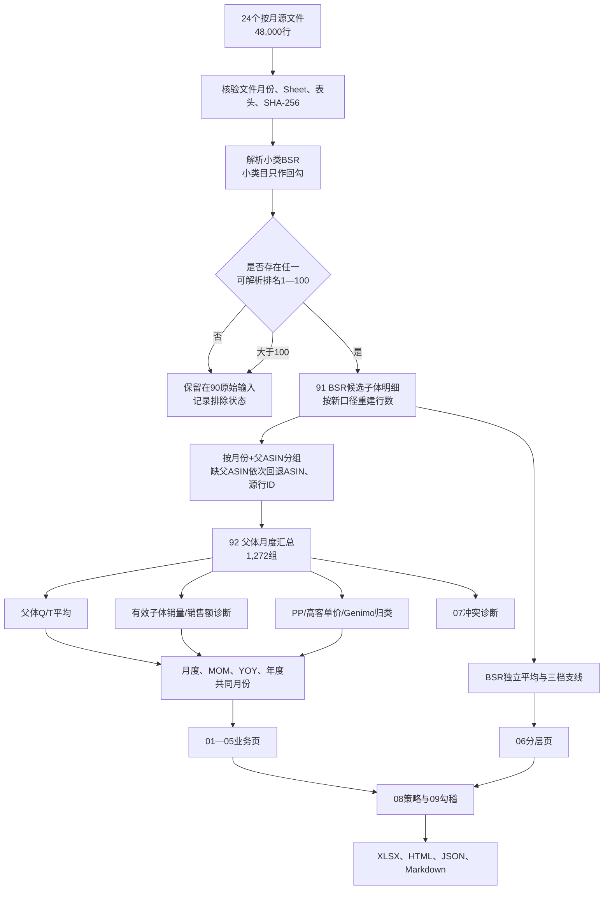

# 户外地垫市场分析：数据处理流程与人工验算

版本：2026-09-23，适用SPEC 3.5。3.5沿用3.4的候选池、Q/T父体平均和增长率定义；BSR在独立支线内按月份+父ASIN对有效排名取平均，再按三档划分。BSR平均不改写92页Q/T主指标。本文中的3.1/3.2/3.3/3.4数字示例在按3.5重建前只能作为历史审计证据，不能作为新口径交付结果。

## 1. 本次交付解决什么问题

交付分成四部分：

1. 整体市场：小类BSR前100候选父体的Q列平均销量、T列平均销售额、父体均价、MOM、YOY；BSR另走独立平均和三档分层支线，子体字段保留作覆盖诊断；
2. PP市场：整体市场中标题按规则命中 `plastic` 的父体；
3. 高客单价市场：整体市场中未归入PP的父体。它是业务名称，不代表每个商品价格一定高；
4. Genimo品牌：同一整体父体池中Genimo父体的表现，并分别展示整体份额和PP内份额，支持2027建议。

报告没有利润、成本、广告、库存或真实成交推断。供应方字段是估算值，清洗只能形成可复核的统一统计口径。

## 2. 输入文件及不可混用范围

唯一输入目录：`data/raw/0920new`。

- 文件数：24；
- 月份：2024.08—2026.07，连续24个月；
- 每个文件只有一个符合 `Competitor-US-YYYYMM` 的业务Sheet；
- 每个业务Sheet月份必须与文件名月份一致；
- 每个文件2,000条业务行，合计48,000行；
- 构建时记录文件名、Sheet名、行数和SHA-256到 `93_来源登记`；
- 原始文件只读，不在原文件内删除、改值或补值。

程序在以下情况直接停止：文件数不是24、月份不连续或重复、业务Sheet月份不符、表头缺失/顺序变化、同一个月份出现重复ASIN。

## 3. 完整数据流程



“父ASIN汇总”不是把候选子体行删除后只保留一条代表行。91页仍保留全部合格候选明细；92页对每个指标按自己的字段语义聚合。这样可以回查每个父体的源行，也避免把某一条BSR行的销量、价格或销售额错误地代表整个父体。

## 4. 第一步：确定小类BSR前100候选池

### 4.1 小类目不参与筛选

源单元格可能用换行保存多个小类和多个排名，例如：

```text
小类目：Outdoor Rugs\nArea Rugs
小类BSR：7\n4
```

两条小类BSR都保留，源行因为存在1—100内的有效排名而进入候选池。不能因为没有 `Outdoor Rugs` 文本而排除，也不能再用类目名称与排名位置配对。

### 4.2 小类BSR筛选规则

1. `小类目`原文保留，但不作为候选条件；
2. 对“小类BSR”按原始换行拆分，逐个清理并解析；
3. 排名只接受正整数或等价的`.0`文本；
4. 只要一行存在至少一个1—100（含边界）的有效排名，该源行进入91页；
5. 多值小类BSR标记`MULTI_BSR`，全部原始排名和解析列表保留；
6. BSR不参与Q/T父体主指标平均；在独立BSR支线内按月份+父体键汇总全部有效1—100排名的算术平均，保留多值和展开关系；
7. 没有任何有效排名标记`INVALID_BSR`，有有效排名但全部大于100标记`OUTSIDE_TOP100`。

状态含义：

| 状态 | 含义 | 是否进入91页 |
| --- | --- | --- |
| `ELIGIBLE` | 至少一个小类BSR排名在1—100 | 是 |
| `MULTI_BSR` | 小类BSR有多个值；若存在1—100仍进入候选池 | 是，带提示 |
| `OUTSIDE_TOP100` | 排名有效但大于100 | 否 |
| `INVALID_BSR` | 小类BSR空白或没有可解析值 | 否 |

### 4.3 多值小类BSR的影响

多值小类BSR不再因为类目名称和排名无法一一对应而自动排除。只要其中有一个有效值落在1—100，源行就进入候选池；多值本身通过`MULTI_BSR`和全部解析排名保留审计痕迹。BSR支线将同一月份+父体内全部有效排名取平均，Q/T主指标不读取该平均值。按3.5重建后，候选行数、父体数和受影响月份必须重新计算，不能继续引用3.1/3.2/3.3/3.4的历史数字。

### 4.4 选用字段与指标

| 源列 | 字段 | 本次作用 |
| --- | --- | --- |
| A/I | ASIN、父ASIN | 父ASIN优先分组，ASIN和源行号是缺失回退键 |
| D/F | 品牌、商品标题 | Genimo识别、PP与高客单价归类 |
| O/P | 小类目、小类BSR | 小类目只回勾；P列负责1—100入池和BSR平均三档 |
| Q/T | 月销量、月销售额($) | 父体主指标，同月同父体分别求有效值平均 |
| U/V | 子体销量、子体销售额($) | 同时有效时求和，仅作覆盖和子体均价诊断 |
| X | 价格($) | 父体平均标价和覆盖诊断，不回填T列 |
| B/C/J/K/L/M/N/W | SKU、详细参数、类目路径、大类目、大类BSR及其增长、变体数 | 原始回查和数据质量诊断 |
| R/S | 源销量环比、同比 | 不直接使用，报告按聚合Q/T重新计算MOM/YOY |
| Y/Z及其余字段 | Prime价格、Coupon、FBA、毛利率、评分、广告等 | 只保留原始快照，不参与利润或市场主指标 |

报告核心指标是父体数、父体Q平均销量合计、父体T平均销售额合计、平均标价、加权成交均价、销量MOM/YOY和销售额MOM/YOY。加权成交均价=父体T平均销售额合计÷父体Q平均销量合计；平均标价按父体内有效X先平均，再对父体做简单平均。

## 5. 第二步：父体分组和重复控制

### 5.1 分组键

每个月独立分组：

```text
父体键 = 父ASIN（优先）
       = ASIN（父ASIN为空时）
       = row:源行号（两者均为空时）
父体月份键 = 月份 + 父体键
```

不跨月去重，因为同一个父体每个月都需要单独计算销量和金额。45,935条候选行和1,272个父体月份组合是3.1历史批次数字，3.5必须重新计算。

### 5.2 同月ASIN重复

同一个月份同一个ASIN若出现多次，会造成子体金额重复累加。当前批次为0组；后续换源只要出现一组就停止发布，不自动保留首行或最后一行。

### 5.3 明细保留方式

91页按以下顺序排序，使同父体明细连续：

```text
月份 → 父体键 → 月销量数值 → ASIN → 源行号
```

排序只方便公式分组和人工回查，不改变源行号。源文件、源Sheet、源行号仍在91页，90页保留48,000行原始字段快照。

## 6. 第三步：父体Q/T主指标平均

Q列“月销量”和T列“月销售额($)”不在父体下相加，而是在同一月份+父体键内对有效值做算术平均：

```text
父体月销量 = AVG(Q列月销量的有效非负值)
父体月销售额 = AVG(T列月销售额($)的有效非负值)
```

空白、`-`、不可解析值和负数不进入平均；明确0进入平均。没有任何有效值时留空并标记`NO_VALUE`，只有部分候选行有值时标记`PARTIAL`，所有候选行都有值时标记`FULL`。平均结果保留小数，不静默取整。

92页同时保存：有效值行数、覆盖率、不同值数、最小值、最大值、平均值和状态。不同值数大于1时标记`AVERAGE_CONFLICT`，用于提醒业务检查源值差异。最小值—最大值用于说明源字段离散程度，不是置信区间。

这是一种源表父体展示值的去重平均，不是订单事实。只有在业务确认Q/T是父体级字段时，平均值才能解释为父体月度指标；如果Q/T实际上随子体或价格变体变化，结果只能称为候选行均值。

## 7. 第四步：子体销量、子体销售额和均价

官方字段说明表明：

- `子体销量`是该子体自然月或近30天销量；
- `子体销售额`是该子体销量×该子体对应期间平均售价；
- `月销售额($)`是父体总销量×当前行子体售价的估算展示，不能在父体下累加；3.3/3.4/3.5将其作为T列父体主销售额的平均输入。

因此3.5的销售额主指标使用T列有效值平均；有效子体销售额仍计算，但只作覆盖和诊断指标。

### 7.1 有效子体行

一行同时满足以下条件才进入子体汇总：

- 子体销量可解析且≥0；
- 子体销售额可解析且≥0；
- 不是“子体销量=0、子体销售额>0”的矛盾组合。

明确的0/0是有效零值。任一字段缺失均不补0，也不使用该行的标价或父体月销量推算。

### 7.2 聚合公式

```text
有效子体销量 = SUM(有效子体行的子体销量)
有效子体销售额 = SUM(同一批有效子体行的子体销售额)
子体覆盖率 = 有效子体行数 ÷ 候选子体行数
有效子体加权均价 = 有效子体销售额 ÷ 有效子体销量
```

均价分母必须是同一批有效子体销量，不能用父体月销量估计，因为二者覆盖范围不同。

状态：

- `NONE`：没有有效子体行，销量/金额/均价全部留空；
- `PARTIAL`：只有部分候选子体行同时有销量与金额；
- `FULL`：所有候选子体行均有效。这里的FULL只指候选行字段完整，不能解释成完整父体所有变体均被采集。

当前1,272个父体月份中，356组没有有效子体销售额。分析金额变化时必须同时看本期和基期覆盖率。

### 7.3 “月销售额($)”保留做什么

它保留在90/91页，仅用于回勾和诊断：

```text
源隐含售价 = 月销售额($) ÷ 月销量
与标价差异率 = 源隐含售价 ÷ 价格($) − 1
```

这些诊断可以帮助发现供应方估算方式，但不进入报告的有效子体销售额。

## 8. 第五步：PP、高客单价和Genimo

### 8.1 PP与高客单价

对子体标题使用完整单词 `plastic`，忽略大小写。按同父体候选子体的非空标题统计：

```text
PP命中率 = plastic命中行数 ÷ 非空标题行数
PP = 命中率≥50%
高客单价 = 非PP
```

父体内部同时出现PP和非PP标题时，92页显示“混合标题，暂按多数归类”，当前共92个父体月份。50%平局当前归PP并保留混合提示，便于人工复核。

对每个月必须满足：

```text
整体父体数 = PP父体数 + 高客单价父体数
整体父体销量估计 = PP父体销量估计 + 高客单价父体销量估计
整体有效子体销售额 = PP有效子体销售额 + 高客单价有效子体销售额
```

均价、覆盖率、MOM和YOY是重新用各自分子分母计算，不能直接把两类比例相加。

### 8.2 Genimo

对同父体候选子体的非空品牌按是否等于 `Genimo` 统计多数。Genimo是品牌视角，不参与“整体=PP+高客单价”的互斥加总。

主要份额：

```text
Genimo整体销量份额 = Genimo父体平均Q销量 ÷ 整体父体平均Q销量
Genimo PP销量份额 = Genimo且PP父体平均Q销量 ÷ 全部PP父体平均Q销量
Genimo整体金额份额 = Genimo父体平均T销售额 ÷ 整体父体平均T销售额
Genimo PP金额份额 = Genimo且PP父体平均T销售额 ÷ PP父体平均T销售额
```

金额份额必须和两侧覆盖率一起阅读。

## 9. 第六步：BSR分层

BSR分层从91页候选明细单独开始，不把BSR平均写入92页。对同一月份+父体键收集所有有效1—100排名，计算一个独立的BSR平均值；多值排名按有效值逐个计入，并保留源行ID。该平均只用于06页分层，不改变92页Q/T父体主指标。

粗档：

- 头部：(0,20]；
- 中部：(20,50]；
- 尾部：(50,100]。

BSR只使用三档：平均BSR在(0,20]归头部、(20,50]归中部、(50,100]归尾部。平均值允许小数，例如20.5归中部。每个父体月份在BSR支线只进入一个档位，三档的父体数、Q平均销量和T平均销售额应分别回加整体市场。

## 10. 第七步：MOM、YOY和年度比较

```text
MOM = 本月值 ÷ 去年同月值 − 1
YOY = 本年共同覆盖月份汇总 ÷ 上一年对应共同覆盖月份汇总 − 1
```

本期或基期为空、基期为0时留空。空白不能变成0%，也不能画成0点。

年度YOY只用双方共同月份：

- 2024：没有去年基期；
- 2025对2024：仅比较8—12月；
- 2026对2025：仅比较1—7月。

05页列出当期月份、基期月份、双方Q/T平均销量和金额、有效行覆盖率、YOY和范围状态。年度只使用双方共同覆盖月份；不能把不完整年度写成“完整全年增长”。

## 11. Excel 16个子表怎样对应流程

| 子表 | 流程位置 | 人工审查重点 |
| --- | --- | --- |
| 00_数据总览 | 批次入口 | 月份、文件、原始行、候选行、父体组合、规则、超链接 |
| 01_整体市场月度 | 第一部分 | 24个月销量、金额、均价、MOM/YOY、覆盖率、冲突、范围提示 |
| 02_PP市场月度 | 第二部分 | 与整体同框架，PP筛选后的值 |
| 03_高客单价月度 | 第三部分 | 与整体同框架，并与PP回加 |
| 04_Genimo品牌月度 | 第四部分 | Genimo在整体市场的同框架表现 |
| 04B_Genimo_PP月度 | 第四部分辅助 | Genimo在PP市场的表现和份额分子 |
| 05_年度YOY | 时间比较 | 共同月份、双方分子分母、覆盖率、范围限制 |
| 06_BSR分层 | 排名结构 | 四个业务范围及Genimo PP、BSR平均三档、月度趋势 |
| 07_父体冲突诊断 | 源值异常 | 所有Q/T多值父体和BSR多值支线提示，不只单一冲突组 |
| 08_2027策略 | 数据驱动建议 | 建议、依据、使用前提；不虚构预算和链接数 |
| 09_勾稽检查 | 机器验收 | PP+高客单价、BSR三档差额应为0；Genimo份额 |
| 90_原始输入 | 源证据 | 48,000行、原始小类/排名、解析排名、BSR状态；小类目只回勾 |
| 91_BSR候选子体明细 | 清洗明细 | 按小类BSR 1—100入池的候选行、有效性、销量频次、隐含价格、源位置 |
| 92_父体月度汇总 | 主要计算层 | 父体Q/T平均、子体诊断、分类公式和状态；BSR平均在06支线计算 |
| 93_来源登记 | 来源控制 | 24个SHA-256、每月行数和四类排除数 |
| 94_规则说明 | 口径说明 | 公式、缺失值、BSR平均三档、分类、重算边界和多值提示 |

91→92→01—05/09，以及91→06的BSR平均三档支线，均保留Excel公式。06支线读取91候选排名和92父体Q/T，但不反向改写92。90、来源身份和结构键是构建快照，不能通过在Excel里任意增删行自动重建；换源或改变候选归属后必须重新运行生成程序。

## 12. 明日人工复算：推荐顺序

### 12.1 先确认文件身份

1. 打开 `93_来源登记`；
2. 确认24个月连续、每月2,000原始行；
3. 确认各月业务Sheet与月份一致；
4. 随机选择2—3个源文件，对比文件SHA-256；
5. 确认总原始行数48,000。

### 12.2 核对候选池

1. 在90页按 `BSR状态=ELIGIBLE` 或 `MULTI_BSR` 筛选，条数以3.5重新构建清单为准；
2. 检查入池依据是小类BSR是否存在1—100有效值，不检查是否包含 `Outdoor Rugs` 文本；
3. 随机抽查多值小类BSR，确认全部原始排名保留，BSR支线按月份+父ASIN对有效排名取平均，再按三档归类；该结果不改写92页Q/T；
4. 检查没有 `Outdoor Rugs` 文本但有合格小类BSR的行不能被排除；
5. 91页条数应与90页合格状态行数一致。

### 12.3 核对父体Q列月销量和T列月销售额

推荐样本：`202607 / B0BM74444Q`。

在91页筛月份和父体键，应得到69行。手工统计Q列和T列：

- Q列有效值数：69；
- Q列合计：302,869；
- 父体月销量平均值：302,869÷69=4,389.405797；
- Q列最小值：3,813；
- Q列最大值：6,468；
- T列有效值数：69；
- T列合计：16,863,623；
- 父体月销售额平均值：16,863,623÷69=244,400.333333；
- Q/T状态：`AVERAGE_CONFLICT`，因为同一父体组内存在多个不同值。
- BSR有效排名数：69；
- BSR有效排名合计：1,327；
- BSR独立平均值：1,327÷69=19.231884，归入头部(0,20]；

92页Q/T主指标和06页BSR支线应分别一致。Q/T平均值保留小数，不取整；BSR平均值只决定06页档位，不写回92页，也不等于某一条代表子体行。

### 12.4 核对子体诊断销售额和均价

同一样本69行中，有效子体行29行：

```text
有效子体销量 = 3,100
有效子体销售额 = 154,430
子体覆盖率 = 29 ÷ 69 = 42.028986%
有效子体加权均价 = 154,430 ÷ 3,100 = 49.816129
```

检查92页的Q/T主指标和子体诊断列。3.5中T列平均值是父体主销售额；29条有效子体得到的154,430和49.816129只作覆盖诊断，不能替换Q/T主指标。不要把T列逐行相加，也不要把子体金额除以父体Q列平均值当作子体均价。

### 12.5 核对月度回加

在09页逐月检查：

- 父体数分区差=0；
- 父体Q列平均销量分区差=0；
- 父体T列平均销售额分区差=0；
- PP+高客单价父体数差=0；
- PP+高客单价Q/T回加差=0；
- BSR三档分别核对父体去重、Q/T覆盖和与整体市场的回加差额；
- 结果=一致。

如果差额不为0，先从92页检查父体分类、销量空白和销售额NONE状态，再检查月度SUMIFS范围。

### 12.6 核对增长率

在01页任选一个非首月：

```text
销量MOM = 本月D列 ÷ 去年同月D列 − 1
销售额MOM = 本月F列 ÷ 去年同月F列 − 1
销量YOY = 本年共同月份销量 ÷ 上一年对应共同月份销量 − 1
销售额YOY = 本年共同月份销售额 ÷ 上一年对应共同月份销售额 − 1
```

再在05页核对年度当期月份和基期月份数量相等。2025行只能用8—12月，2026行只能用1—7月。

### 12.7 核对网页与Excel

1. HTML顶部批次应与3.5重新构建后的构建清单一致；
2. 数据总览的候选行数和父体月份组合必须以3.5重新构建后的结果为准；
3. 四个导航都能打开1.1—1.7；
4. 小节可单独折叠，也可全部展开/收起；
5. 图表悬浮显示月份和值，空白不显示0点；
6. 父体检索输入 `B0BM74444Q` 后，应能看到Q列平均4,389.405797、T列平均244,400.333333，并同时看到子体诊断154,430；
7. 页面下载的XLSX与输出目录文件哈希一致。

## 13. 已执行的机器审计（SPEC 3.1/3.2历史批次）

以下数字和PASS结果对应2026-09-22生成的SPEC 3.1批次，只用于解释旧交付的内部一致性。3.2取消了Outdoor Rugs文本筛选并改变了MOM定义，3.3改为父体Q/T有效值平均，3.4将BSR拆为独立支线，3.5又明确BSR支线平均和三档；因此必须按3.5重新构建、重新审计后才能作为当前交付证据。

### 13.1 源、模型和跨文件审计

`npm run test:parent`已通过：

- 独立重新读取24个文件；
- 48,000原始行、45,935候选行、354范围未对应行逐月一致；
- 1,272父体月份组合；
- 同月ASIN重复0组；
- 整体=PP+高客单价逐月回加；
- 旧3.1批次粗档和五档逐月回加（历史口径，SPEC 3.5不沿用）；
- 50/50销量平局、严格多数、无有效金额、共同月份年度测试；
- 16个Excel子表、公式存在、缓存值与模型一致；
- HTML和JSON批次、口径提示一致。

结果保存在 `outputs/20260920-new-source-parent-model/完整审计结果.json`。

### 13.2 独立公式求值和输入扰动

`npm run test:parent:formula`调用 `tests/parent_formula_audit.py`。它没有使用工作簿保存的缓存替代计算，而是用限定函数的独立解释器重新求值378,821个公式，差异0。随后在内存副本中测试：

1. 一个有效子体销售额+100：父体金额、均价和整体月度金额都增加100；
2. 样本父体所有子体销量/金额清空：父体金额留空，状态NONE，不出现0或-100%；
3. 加入明确0/0：有效行数增加，金额为数值0。

该测试不修改交付XLSX。

## 14. 审计边界和剩余人工事项

- 完整XLSX约15MB。Artifact Tool完整导入超过可接受时间，因此只对裁剪代表页做可视预览；公式已用独立解释器逐项验证。
- 尚不能把独立公式测试称为“桌面Excel整簿重算”。明日建议在Excel中打开，等待重算完成后检查09页差额仍为0。
- 3.1的Outdoor Rugs类目与排名歧义规则已废止；多值小类BSR按3.2保留并标记，重建后需要重新审查候选范围。
- 681个销量多值父体说明供应方父体字段在子体行间不完全一致。当前输出是可复核清洗估计；若业务要求真实成交，必须改用Seller Central或其他真实订单源。
- 356个父体月份无有效子体销售额，所有金额趋势都要和覆盖率一起使用。
- HTML、JSON和Markdown是构建快照。人工改Excel后网页不会自动变化；正式修订必须改源或规则、重新构建整批文件，再重新审计和发布。

## 15. 发现不一致时怎样定位

| 发现的问题 | 优先检查 | 处理方式 |
| --- | --- | --- |
| 候选行数不一致 | 90页小类目、小类BSR、解析排名、BSR状态 | 检查是否错误使用Outdoor Rugs文本筛选、是否漏保留多值小类BSR、是否误把大于100的值入池 |
| 父体数不一致 | 91父体键、月份、ASIN重复 | 检查父ASIN空值回退及同月重复ASIN |
| 父体Q/T不一致 | 91月销量、月销售额($)及有效性列；92主指标和诊断列 | 检查有效值平均、覆盖率、最小值、最大值、AVERAGE_CONFLICT和空值 |
| 销售额不一致 | 91 Q列有效性、K/L列；92 R—W | 只能累加同时有效的子体字段，不用月销售额($) |
| PP/高客单价不一致 | 91标题和N列；92 Z/AF | 检查完整单词plastic、多数和混合标题 |
| MOM/YOY不一致 | 01—04本月与基期行 | MOM检查去年同月；YOY检查本年与上一年共同月份、基期0和覆盖提示 |
| BSR档位不一致 | 91解析排名、06页 | 在独立支线按月份+父ASIN平均有效排名，再按三档归类；不得改写92页Q/T |
| 网页与Excel不一致 | 构建批次、JSON、构建清单 | 重新运行整批构建，不单独手改HTML |
